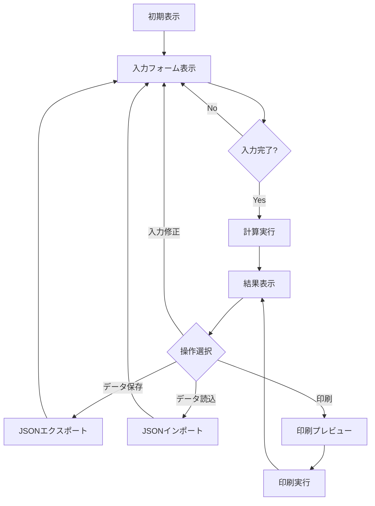

# 相次相続控除額 計算シミュレーター（家系図表示版）
# サイト構造設計書 v2.0

**文書バージョン:** 2.0  
**作成日:** 2025年6月18日  
**作成者:** Manus AI

## 1. 全体構成

### 1.1 サイト構造

```
相次相続控除額 計算シミュレーター
├── ヘッダー
│   ├── タイトル
│   └── 操作メニュー（保存/読込/印刷）
├── メインコンテンツ
│   ├── 説明セクション
│   │   ├── 相次相続控除の概要
│   │   └── 計算式の説明
│   ├── 入力セクション
│   │   ├── 相続日入力パネル
│   │   ├── 被相続人情報パネル
│   │   ├── 相続財産情報パネル
│   │   └── 相続人情報パネル
│   ├── 家系図セクション
│   │   ├── 家系図表示エリア
│   │   ├── 操作コントロール（拡大/縮小/リセット）
│   │   └── 表示オプション（控除額表示切替）
│   └── 結果セクション
│       ├── 計算結果サマリー
│       └── 詳細結果テーブル
└── フッター
    ├── 著作権表示
    ├── 免責事項
    └── 問い合わせ先
```

### 1.2 画面遷移図



## 2. レイアウト設計

### 2.1 デスクトップレイアウト（1200px以上）

```
+-------------------------------------------------------+
|                      ヘッダー                          |
+-------------------------------------------------------+
|                   説明セクション                       |
+------------------------+------------------------------+
|                        |                              |
|                        |                              |
|    入力セクション      |       家系図セクション       |
|                        |                              |
|                        |                              |
+------------------------+------------------------------+
|                   結果セクション                       |
+-------------------------------------------------------+
|                      フッター                          |
+-------------------------------------------------------+
```

### 2.2 タブレットレイアウト（768px〜1199px）

```
+-------------------------------------------------------+
|                      ヘッダー                          |
+-------------------------------------------------------+
|                   説明セクション                       |
+-------------------------------------------------------+
|                   入力セクション                       |
+-------------------------------------------------------+
|                  家系図セクション                      |
+-------------------------------------------------------+
|                   結果セクション                       |
+-------------------------------------------------------+
|                      フッター                          |
+-------------------------------------------------------+
```

### 2.3 モバイルレイアウト（767px以下）

```
+-------------------------------------------------------+
|                      ヘッダー                          |
+-------------------------------------------------------+
|                   説明セクション                       |
+-------------------------------------------------------+
|                    タブナビゲーション                  |
| +----------+ +----------+ +----------+ +----------+   |
| |  入力    | |  家系図  | |  結果    | |  ヘルプ  |   |
| +----------+ +----------+ +----------+ +----------+   |
+-------------------------------------------------------+
|                                                       |
|                                                       |
|                  選択タブの内容                       |
|                                                       |
|                                                       |
+-------------------------------------------------------+
|                      フッター                          |
+-------------------------------------------------------+
```

## 3. コンポーネント設計

### 3.1 ヘッダーコンポーネント

- **タイトル**: 「相次相続控除額 計算シミュレーター」
- **操作メニュー**:
  - データ保存ボタン（JSONエクスポート）
  - データ読込ボタン（JSONインポート）
  - 印刷ボタン
  - リセットボタン

### 3.2 説明セクションコンポーネント

- **概要パネル**:
  - 相次相続控除の定義と目的
  - 適用条件の説明
  - 展開/折りたたみ機能
- **計算式パネル**:
  - 計算式の数式表示: A × (C / B) × (D / C) × (10 - E) / 10
  - 各変数の説明
  - 計算例へのリンク

### 3.3 入力セクションコンポーネント

- **相続日入力パネル**:
  - 1回目の相続日入力フィールド（西暦/和暦切替機能付き）
  - 2回目の相続日入力フィールド（西暦/和暦切替機能付き）
  - 経過年数表示フィールド（自動計算、編集不可）
  - カレンダーピッカー
  - 入力ヘルプアイコン

- **被相続人情報パネル**:
  - 被相続人名前入力フィールド
  - A: 前回の相続で納めた相続税額入力フィールド
  - B: 前回に取得した財産の価額入力フィールド
  - 入力ヘルプアイコン

- **相続財産情報パネル**:
  - C: 今回の相続財産の総額入力フィールド
  - 入力ヘルプアイコン

- **相続人情報パネル**:
  - 相続人追加/削除ボタン
  - 各相続人の情報入力フィールド:
    - 名前
    - 続柄選択（配偶者/長男/二男/長女/二女など）
    - ステータス選択（法定相続人/死亡/相続放棄/相続欠格/想定外）
    - D: 取得した財産の価額入力フィールド
  - 入力ヘルプアイコン

### 3.4 家系図セクションコンポーネント

- **家系図表示エリア**:
  - SVGベースの家系図
  - 人物アイコン（性別による色分け）
  - 関係線
  - 死亡マーク（該当者）
  - 相続放棄/相続欠格マーク（該当者）
  - 相次相続控除額表示（計算後、トグル制御）

- **操作コントロール**:
  - 拡大ボタン
  - 縮小ボタン
  - リセットボタン（初期表示に戻す）
  - 全体表示ボタン

- **表示オプション**:
  - 控除額表示トグル
  - 詳細情報表示トグル

### 3.5 結果セクションコンポーネント

- **計算結果サマリー**:
  - 総相次相続控除額表示
  - 計算式の適用結果表示

- **詳細結果テーブル**:
  - 各相続人ごとの計算結果一覧
  - 各変数の値と計算過程の表示
  - 控除額の合計

### 3.6 フッターコンポーネント

- **著作権表示**: © 2025 相次相続控除額 計算シミュレーター
- **免責事項**: 計算結果の利用に関する注意事項
- **問い合わせ先**: サポート情報

## 4. 入力項目の詳細説明設計

### 4.1 相続日入力の説明

- **1回目の相続日**:
  ```
  1回目の相続日とは、前回の被相続人（例：祖父母）が亡くなった日付です。
  この日付が相続税の納税義務が発生した日となります。
  西暦または和暦で入力してください。
  ```

- **2回目の相続日**:
  ```
  2回目の相続日とは、今回の被相続人（例：父母）が亡くなった日付です。
  この日付が今回の相続税の納税義務が発生した日となります。
  西暦または和暦で入力してください。
  ```

- **経過年数（E）**:
  ```
  1回目の相続日から2回目の相続日までの経過年数です。
  1年未満の端数は切り捨てられます。
  経過年数が10年以上の場合、相次相続控除は適用されません。
  ```

### 4.2 被相続人情報の説明

- **被相続人名**:
  ```
  今回の相続における被相続人（亡くなった方）の名前を入力してください。
  家系図上に表示されます。
  ```

- **A: 前回の相続で納めた相続税額**:
  ```
  前回の相続（1回目の相続日）で、今回の被相続人が実際に納付した相続税額を入力してください。
  この金額が相次相続控除の基礎となります。
  ```

- **B: 前回に取得した財産の価額**:
  ```
  前回の相続（1回目の相続日）で、今回の被相続人が取得した財産の価額（課税価格）を入力してください。
  この金額は前回の相続税の計算の基礎となった金額です。
  ```

### 4.3 相続財産情報の説明

- **C: 今回の相続財産の総額**:
  ```
  今回の相続における相続財産の総額（課税価格の合計額）を入力してください。
  すべての相続人が取得した財産の合計額となります。
  ```

### 4.4 相続人情報の説明

- **相続人名**:
  ```
  相続人の名前を入力してください。
  家系図上に表示されます。
  ```

- **続柄**:
  ```
  被相続人との続柄を選択してください。
  選択肢: 配偶者、長男、二男、三男、長女、二女、三女、その他
  家系図上の位置決定に使用されます。
  ```

- **ステータス**:
  ```
  相続人の法的ステータスを選択してください。
  - 法定相続人: 相続権があり、実際に相続する方
  - 死亡: 相続開始前に死亡している方
  - 相続放棄: 相続権を放棄した方
  - 相続欠格: 法律上の理由で相続権を失った方
  - 想定外: その他のケース
  相次相続控除は「法定相続人」のステータスの方のみ適用されます。
  ```

- **D: 取得した財産の価額**:
  ```
  この相続人が今回の相続で取得した財産の価額（課税価格）を入力してください。
  すべての相続人の取得財産の合計が「C: 今回の相続財産の総額」と一致する必要があります。
  ```

## 5. 家系図表示設計

### 5.1 基本レイアウト

```
       [祖父]───┬───[祖母]
                │
       [父/母]──┬──[配偶者]
        │       │       │
   ┌────┼────┐  │
[長男/長女][二男/二女][三男/三女]
```

### 5.2 人物アイコン設計

- **男性アイコン**:
  - 形状: 円形
  - 色: 青系色（#3949AB）
  - サイズ: 60px × 60px（デスクトップ）、40px × 40px（モバイル）

- **女性アイコン**:
  - 形状: 円形
  - 色: 赤系色（#E53935）
  - サイズ: 60px × 60px（デスクトップ）、40px × 40px（モバイル）

- **死亡表示**:
  - 斜め十字（×）のオーバーレイ
  - 色: 黒（#000000）
  - 線幅: 2px

- **相続放棄表示**:
  - 点線の円枠
  - 色: グレー（#757575）
  - 線幅: 2px

- **相続欠格表示**:
  - 二重線の斜め十字
  - 色: 赤（#D32F2F）
  - 線幅: 2px

### 5.3 関係線設計

- **婚姻関係**:
  - 水平実線
  - 色: 黒（#000000）
  - 線幅: 2px

- **親子関係**:
  - 垂直実線
  - 色: 黒（#000000）
  - 線幅: 2px

- **兄弟関係**:
  - 水平実線（親子関係線から分岐）
  - 色: 黒（#000000）
  - 線幅: 2px

### 5.4 情報表示設計

- **名前表示**:
  - 位置: アイコンの下部
  - フォント: Noto Sans JP
  - サイズ: 14px（デスクトップ）、12px（モバイル）
  - 色: 黒（#000000）

- **死亡日表示**:
  - 位置: 名前の下部
  - フォント: Noto Sans JP
  - サイズ: 12px（デスクトップ）、10px（モバイル）
  - 色: グレー（#616161）

- **相次相続控除額表示**:
  - 位置: アイコンの右側（吹き出し形式）
  - 背景色: 薄い青（#E3F2FD）
  - 枠線: 青（#2196F3）
  - フォント: Noto Sans JP
  - サイズ: 14px（デスクトップ）、12px（モバイル）
  - 色: 黒（#000000）

## 6. インタラクション設計

### 6.1 入力フォームのインタラクション

- **数値入力フィールド**:
  - フォーカス時: 枠線強調（色: #2196F3）
  - 入力中: 3桁区切りなし
  - フォーカス外れ時: 3桁区切り表示
  - エラー時: 赤枠表示（色: #F44336）とエラーメッセージ

- **日付入力フィールド**:
  - フォーカス時: カレンダーピッカー表示
  - 和暦/西暦切替: トグルボタンで切替
  - 入力完了時: 経過年数自動計算

- **ドロップダウン選択**:
  - クリック時: オプションリスト表示
  - 選択時: 選択内容に応じた家系図更新

- **ヘルプアイコン**:
  - ホバー時: ツールチップ表示
  - クリック時: 詳細説明モーダル表示

### 6.2 家系図のインタラクション

- **人物アイコン**:
  - ホバー時: ハイライト表示（明るい色に変化）
  - クリック時: 詳細情報ポップアップ表示

- **拡大/縮小**:
  - 拡大ボタン: 家系図を25%拡大
  - 縮小ボタン: 家系図を25%縮小
  - リセットボタン: 初期サイズに戻す
  - ピンチジェスチャー: タッチデバイスでの拡大縮小

- **パン操作**:
  - ドラッグ: 家系図の表示位置移動
  - スワイプ: タッチデバイスでの表示位置移動

- **表示切替**:
  - 控除額表示トグル: ON/OFFで控除額表示切替
  - 詳細情報トグル: ON/OFFで詳細情報表示切替

### 6.3 計算結果のインタラクション

- **計算実行**:
  - 入力完了時: 自動計算実行
  - 計算ボタンクリック時: 手動計算実行
  - 計算中: プログレスインジケーター表示

- **結果表示**:
  - 計算完了時: 結果セクションへスクロール
  - 詳細表示ボタン: 詳細計算過程の展開/折りたたみ

- **エラー表示**:
  - エラー発生時: エラーメッセージ表示と該当フィールドハイライト
  - 警告発生時: 警告メッセージ表示（黄色背景）

## 7. 説明コンテンツ設計

### 7.1 相次相続控除の概要説明

```
【相次相続控除とは】

相次相続控除とは、10年以内に発生した2回の相続において、1回目の相続で支払った相続税の一部を2回目の相続税から控除できる制度です。

短期間に2回相続が発生した場合、同じ財産に対して短期間に2度相続税が課税されることになり、相続人の税負担が過重になる可能性があります。この負担を軽減するために設けられた制度です。

【適用条件】
1. 前回の相続から10年以内に次の相続が発生していること
2. 前回の相続で相続税を納付していること
3. 今回の相続人が法定相続人であること

【控除額の計算式】
控除額 = A × (C / B) × (D / C) × (10 - E) / 10

A: 前回の相続で納めた相続税額
B: 前回に取得した財産の価額
C: 今回の相続財産の総額
D: 相続人が今回取得した財産の価額
E: 前回の相続からの経過年数（1年未満切り捨て）
```

### 7.2 計算式の詳細説明

```
【計算式の意味】

相次相続控除額 = A × (C / B) × (D / C) × (10 - E) / 10

各要素の意味:

A × (C / B): 前回納付した相続税のうち、今回の相続財産に対応する部分
(D / C): 今回の相続財産のうち、各相続人が取得した割合
(10 - E) / 10: 経過年数による控除率（経過年数が長いほど控除額は少なくなる）

【計算例】
例えば:
- 前回の相続税額(A): 1,700万円
- 前回取得財産額(B): 8,200万円
- 今回の相続財産総額(C): 4億8,400万円
- 相続人の取得財産額(D): 2億8,000万円
- 経過年数(E): 5年

控除額 = 1,700万円 × (4億8,400万円 / 8,200万円) × (2億8,000万円 / 4億8,400万円) × (10 - 5) / 10
     = 1,700万円 × 5.9 × 0.58 × 0.5
     = 約491万7,250円
```

### 7.3 入力項目A〜Eの詳細説明

```
【A: 前回の相続で納めた相続税額】
これは、前回の相続（1回目の相続日）で今回の被相続人が実際に納付した相続税額です。相続税の申告書や納税証明書で確認できます。この金額が相次相続控除の基礎となります。

【B: 前回に取得した財産の価額】
前回の相続で今回の被相続人が取得した財産の価額（課税価格）です。相続税の申告書の「課税価格」の欄で確認できます。この金額は前回の相続税の計算の基礎となった金額です。

【C: 今回の相続財産の総額】
今回の相続における相続財産の総額（課税価格の合計額）です。すべての相続人が取得した財産の合計額となります。相続税の申告書の「課税価格の合計額」の欄に相当します。

【D: 相続人が今回取得した財産の価額】
各相続人が今回の相続で取得した財産の価額（課税価格）です。各相続人ごとに異なる値となります。相続税の申告書の各相続人の「課税価格」の欄に相当します。

【E: 前回の相続からの経過年数】
1回目の相続日から2回目の相続日までの経過年数です。1年未満の端数は切り捨てられます。例えば、4年11ヶ月の場合は4年として計算されます。経過年数が10年以上の場合、相次相続控除は適用されません。
```

### 7.4 相続人ステータスの説明

```
【法定相続人】
民法で定められた相続権を持つ人で、実際に相続する方です。配偶者、子、父母、兄弟姉妹などが該当します。相次相続控除は法定相続人のみに適用されます。

【死亡】
相続開始前に死亡している方です。相続権はありません。

【相続放棄】
相続の権利を放棄した方です。相続開始を知った時から3ヶ月以内に家庭裁判所に申述する必要があります。相続放棄をすると、初めから相続人ではなかったものとみなされます。

【相続欠格】
故意に被相続人や他の相続人を死亡させるなど、法律で定められた事由により相続権を失った方です。

【想定外】
上記に当てはまらない特殊なケースです。
```

### 7.5 よくある質問（FAQ）

```
【Q1】相次相続控除はどのような場合に適用されますか？
【A1】10年以内に2回の相続が発生し、1回目の相続で相続税を納付している場合に適用されます。例えば、祖父が亡くなった後、短期間のうちに父も亡くなった場合などです。

【Q2】相続放棄をした場合、相次相続控除は適用されますか？
【A2】相続放棄をした方は法定相続人ではなくなるため、相次相続控除は適用されません。

【Q3】前回の相続で相続税がかからなかった場合はどうなりますか？
【A3】前回の相続で相続税が発生していない場合（A=0の場合）、相次相続控除は適用されません。

【Q4】経過年数はどのように計算されますか？
【A4】1回目の相続日から2回目の相続日までの年数で、1年未満の端数は切り捨てられます。例えば、4年11ヶ月の場合は4年として計算されます。

【Q5】複数の相続人がいる場合、相次相続控除はどのように計算されますか？
【A5】各法定相続人ごとに、その取得した財産の価額に応じて個別に計算されます。各相続人のDの値が異なるため、控除額も異なります。
```

## 8. アクセシビリティ設計

### 8.1 キーボードアクセシビリティ

- **フォーカス順序**:
  1. ヘッダーメニュー
  2. 説明セクション展開/折りたたみボタン
  3. 相続日入力フィールド（順次）
  4. 被相続人情報入力フィールド（順次）
  5. 相続財産情報入力フィールド
  6. 相続人情報入力フィールド（相続人ごとにグループ化）
  7. 家系図操作コントロール
  8. 計算ボタン
  9. 結果セクションコントロール
  10. フッターリンク

- **フォーカス表示**:
  - 視覚的に明確なフォーカスインジケーター
  - 色: #2196F3
  - 幅: 2px
  - スタイル: 実線

### 8.2 スクリーンリーダー対応

- **ARIA属性**:
  - `aria-label`: 視覚的なラベルがない要素に対して
  - `aria-labelledby`: 関連するラベル要素がある場合
  - `aria-describedby`: 詳細説明が別要素にある場合
  - `aria-required`: 必須入力フィールド
  - `aria-invalid`: 入力エラー時
  - `aria-live`: 動的に更新される領域

- **家系図のアクセシビリティ**:
  - SVG要素に適切な`role`と`aria-*`属性を設定
  - 家系図の構造をテキストで説明する代替コンテンツ
  - 各人物の関係性を明示的に記述

### 8.3 色覚多様性対応

- **コントラスト比**:
  - テキストと背景: 4.5:1以上
  - 大きなテキストと背景: 3:1以上
  - UI要素と背景: 3:1以上

- **色以外の識別手段**:
  - 性別表示: 色だけでなくアイコン形状も変える
  - ステータス表示: 色だけでなくパターンや形状も使用
  - エラー表示: 色だけでなくアイコンやテキストメッセージも使用

## 9. 印刷レイアウト設計

### 9.1 印刷用スタイル

- **ページサイズ**: A4
- **余白**: 上下左右20mm
- **フォント**: 印刷に適したセリフフォント
- **色**: モノクロ印刷を考慮した配色

### 9.2 印刷コンテンツ構成

```
+-------------------------------------------------------+
|                      タイトル                          |
+-------------------------------------------------------+
|                      家系図                            |
+-------------------------------------------------------+
|                    入力情報一覧                        |
+-------------------------------------------------------+
|                    計算結果詳細                        |
+-------------------------------------------------------+
|                  計算式と説明                          |
+-------------------------------------------------------+
|                    注意事項                            |
+-------------------------------------------------------+
```

### 9.3 印刷用家系図

- **サイズ**: ページ幅の80%
- **線の太さ**: 印刷に適した太さ（0.5pt以上）
- **テキスト**: 最小8pt以上のサイズ
- **グレースケール**: 色の代わりにパターンや形状で区別

## 10. エラー・警告メッセージ設計

### 10.1 入力検証エラー

- **必須項目未入力**:
  ```
  [項目名]は必須項目です。入力してください。
  ```

- **数値以外の入力**:
  ```
  [項目名]には数値を入力してください。
  ```

- **負の値の入力**:
  ```
  [項目名]には0以上の値を入力してください。
  ```

- **無効な日付**:
  ```
  有効な日付を入力してください。（例: 2025-06-18）
  ```

- **未来の日付**:
  ```
  過去の日付を入力してください。未来の日付は入力できません。
  ```

- **日付順序エラー**:
  ```
  2回目の相続日は1回目の相続日より後である必要があります。
  ```

### 10.2 計算関連警告

- **10年超過警告**:
  ```
  前回の相続から10年以上経過しているため、相次相続控除は適用されません。
  ```

- **取得財産額不一致警告**:
  ```
  相続人の取得財産額の合計が相続財産総額と一致しません。
  現在の合計: [合計額]円、相続財産総額: [C値]円
  ```

- **法定相続人なし警告**:
  ```
  法定相続人が設定されていないため、相次相続控除は計算されません。
  少なくとも1人の相続人のステータスを「法定相続人」に設定してください。
  ```

- **ゼロ除算警告**:
  ```
  [項目名]がゼロのため、計算できません。
  0より大きい値を入力してください。
  ```

## 11. データ構造設計

### 11.1 入力データモデル

```javascript
{
  // 相続日情報
  "firstInheritanceDate": "2016-03-26", // 1回目の相続日（ISO形式）
  "secondInheritanceDate": "2021-05-04", // 2回目の相続日（ISO形式）
  "yearsPassed": 5, // 経過年数（自動計算）
  
  // 被相続人情報
  "deceasedName": "山田太郎", // 被相続人名
  "previousTaxAmount": 17000000, // A: 前回の相続で納めた相続税額
  "previousAssetValue": 82000000, // B: 前回に取得した財産の価額
  
  // 相続財産情報
  "totalAssetValue": 484000000, // C: 今回の相続財産の総額
  
  // 相続人情報
  "heirs": [
    {
      "id": "heir1",
      "name": "山田一郎", // 相続人名
      "relation": "長男", // 続柄
      "status": "法定相続人", // ステータス
      "assetValue": 280000000, // D: 取得した財産の価額
      "deductionAmount": 4917250 // 計算された相次相続控除額
    },
    {
      "id": "heir2",
      "name": "山田二郎",
      "relation": "二男",
      "status": "法定相続人",
      "assetValue": 120000000,
      "deductionAmount": 2107393
    },
    {
      "id": "heir3",
      "name": "山田花子",
      "relation": "長女",
      "status": "相続放棄",
      "assetValue": 0,
      "deductionAmount": 0
    }
  ],
  
  // 計算結果
  "totalDeductionAmount": 7024643, // 総相次相続控除額
  "calculationTimestamp": "2025-06-18T12:34:56" // 計算実行日時
}
```

### 11.2 家系図データモデル

```javascript
{
  "familyTree": {
    // 第1世代
    "generation1": [
      {
        "id": "grandfather",
        "name": "山田源一", // 祖父
        "gender": "male",
        "status": "deceased",
        "deathDate": "2016-03-26",
        "position": { "x": 100, "y": 50 }
      },
      {
        "id": "grandmother",
        "name": "山田幸子", // 祖母
        "gender": "female",
        "status": "alive",
        "position": { "x": 250, "y": 50 }
      }
    ],
    
    // 第2世代
    "generation2": [
      {
        "id": "father",
        "name": "山田太郎", // 父（被相続人）
        "gender": "male",
        "status": "deceased",
        "deathDate": "2021-05-04",
        "previousTaxAmount": 17000000,
        "previousAssetValue": 82000000,
        "position": { "x": 100, "y": 150 },
        "parents": ["grandfather", "grandmother"]
      },
      {
        "id": "mother",
        "name": "山田花子", // 母
        "gender": "female",
        "status": "alive",
        "position": { "x": 250, "y": 150 },
        "spouse": "father"
      }
    ],
    
    // 第3世代
    "generation3": [
      {
        "id": "heir1",
        "name": "山田一郎", // 長男
        "gender": "male",
        "status": "alive",
        "relation": "長男",
        "heirStatus": "法定相続人",
        "assetValue": 280000000,
        "deductionAmount": 4917250,
        "position": { "x": 50, "y": 250 },
        "parents": ["father", "mother"]
      },
      {
        "id": "heir2",
        "name": "山田二郎", // 二男
        "gender": "male",
        "status": "alive",
        "relation": "二男",
        "heirStatus": "法定相続人",
        "assetValue": 120000000,
        "deductionAmount": 2107393,
        "position": { "x": 175, "y": 250 },
        "parents": ["father", "mother"]
      },
      {
        "id": "heir3",
        "name": "山田花子", // 長女
        "gender": "female",
        "status": "alive",
        "relation": "長女",
        "heirStatus": "相続放棄",
        "assetValue": 0,
        "deductionAmount": 0,
        "position": { "x": 300, "y": 250 },
        "parents": ["father", "mother"]
      }
    ]
  },
  
  // 関係線
  "relationships": [
    {
      "type": "marriage",
      "from": "grandfather",
      "to": "grandmother"
    },
    {
      "type": "parent-child",
      "from": "grandfather",
      "to": "father"
    },
    {
      "type": "marriage",
      "from": "father",
      "to": "mother"
    },
    {
      "type": "parent-child",
      "from": "father",
      "to": ["heir1", "heir2", "heir3"]
    }
  ]
}
```
